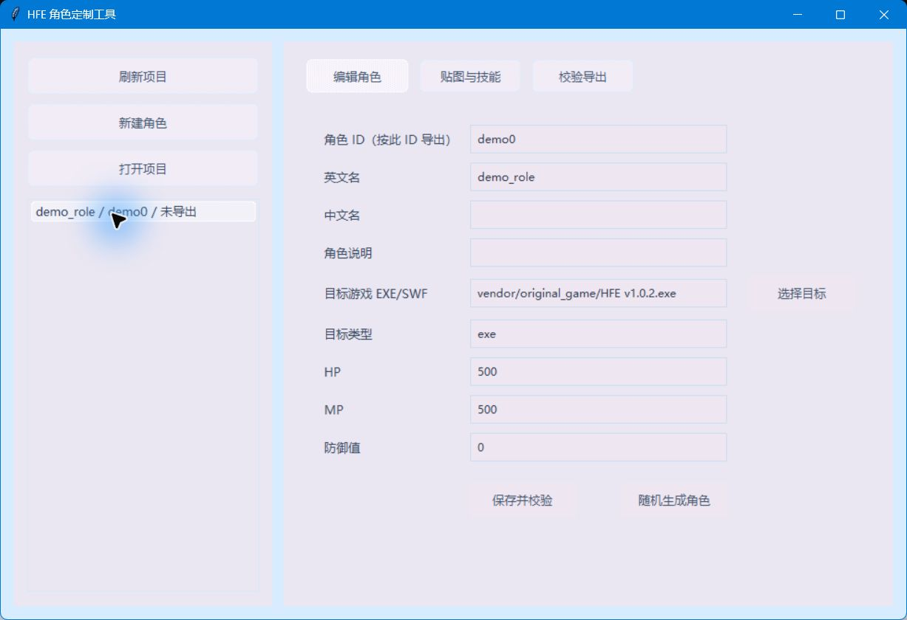
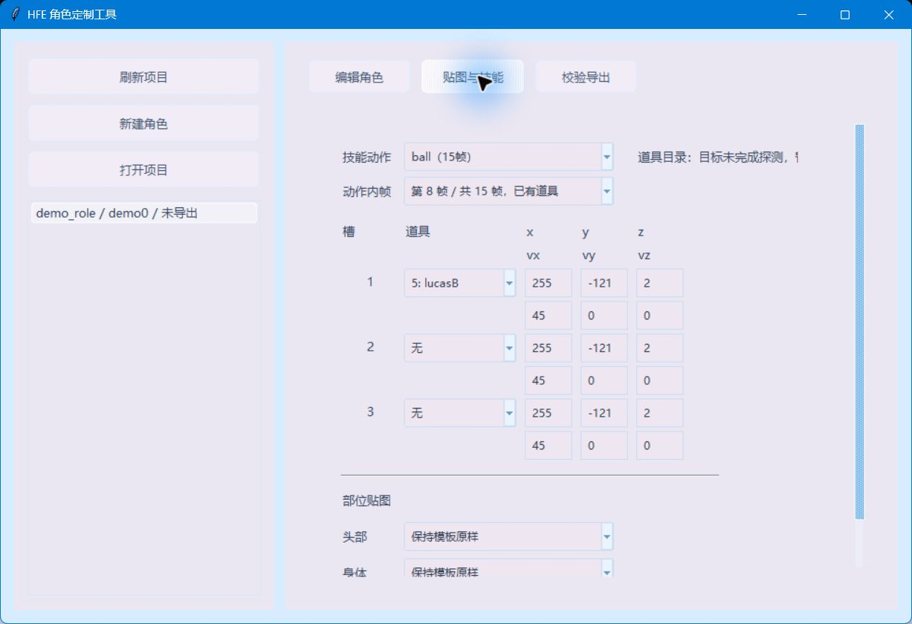
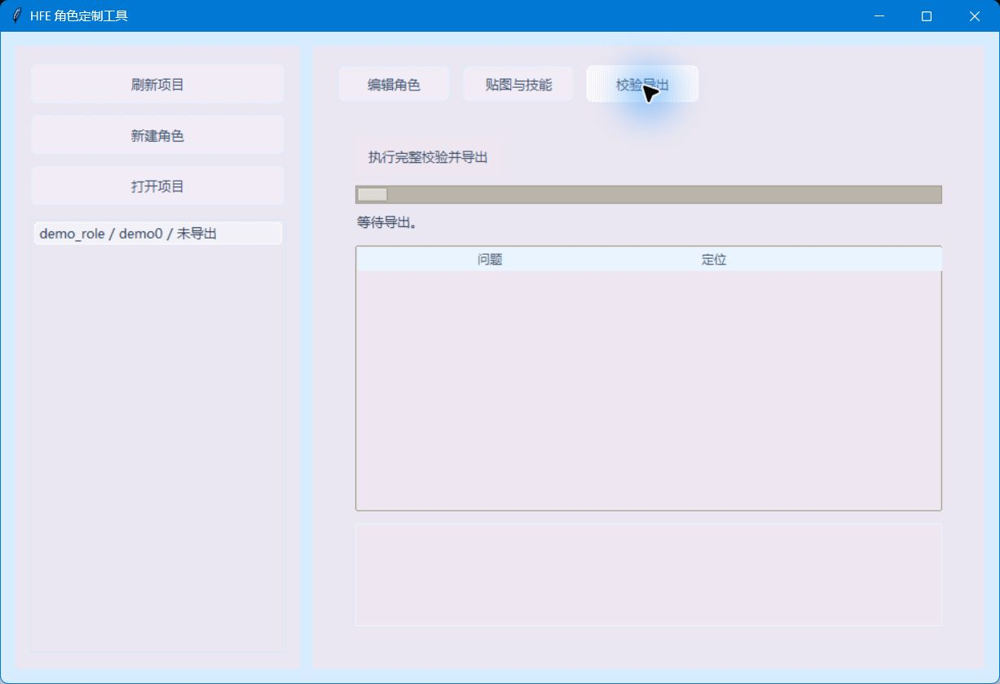

# HFE 角色定制工具

这是一个用于制作和导出 HFE / Hero Fighter 自定义角色的 Windows 图形化工具。工具的目标是让不熟悉 FFDec、HFWorkshop、SPT/LMI 和 SWF 补丁流程的玩家，也能通过界面完成角色模板选择、贴图配置、道具帧编辑、校验和导出。

本仓库只包含工具源码、测试和公开文档，不包含原游戏文件、第三方工具二进制、玩家本地项目或导出的游戏文件。

## 主要功能

- 新建和管理自定义角色项目。
- 先选择目标 HFE EXE/SWF，再按目标版本读取可用角色模板和道具目录。
- 编辑角色 ID、名称、中文名、说明、HP、MP、防御等基础信息。
- 按角色动作和动作内帧配置道具生成。
- 为角色部位选择贴图来源。
- 导出前执行校验，阻止明显不兼容的配置。
- 支持在已经改过的目标版本上继续追加角色。
- 支持随机生成角色属性、贴图组合和道具帧配置。

## 界面预览

### 编辑角色



### 贴图与技能



### 校验导出



## 仓库结构

```text
src/hfe_character_tool/   工具源码
tests/                    自动化测试
docs/                     用户文档
scripts/                  本地打包脚本
vendor/README.md          外部依赖摆放说明
pyproject.toml            Python 项目配置
```

## 不包含的内容

以下内容不会放进仓库，需要使用者在本地自行准备：

- HFE / Hero Fighter 原版或改版游戏文件。
- FFDec、HFWorkshop、SA.exe、playerglobal.swc 等第三方工具。
- Java/JDK 运行环境。
- `projects/` 下的本地角色项目。
- `output/` 下的导出 EXE/SWF、缓存和日志。

## 外部依赖目录

真实导出游戏前，请在仓库根目录按下面结构准备依赖：

```text
vendor/
  FFDec/
    ffdec.jar
  HFWorkshop/
    HFWorkshop.exe
  projector/
    SA.exe
  playerGlobal/
    playerglobal.swc
  original_game/
    HFE v1.0.2.exe
```

Java/JDK 可以安装到系统 PATH，也可以放在仓库附近的这些目录之一：

```text
runtime/jdk/
runtime/jdk-*/
jdk/
jdk-*/
```

更详细的说明见 `docs/dependencies.md`。

## 开发环境

建议使用 Python 3.8 或更新版本。

```powershell
python -m venv .venv
.\.venv\Scripts\Activate.ps1
python -m pip install --upgrade pip
python -m pip install -e ".[dev]"
```

运行测试和检查：

```powershell
python -m pytest -q
python -m mypy src tests
python -m ruff check src tests
```

从源码启动：

```powershell
$env:PYTHONPATH = "src"
$env:PYTHONUTF8 = "1"
python -m hfe_character_tool
```

## 本地打包 Windows EXE

先安装打包依赖：

```powershell
python -m pip install -e ".[package]"
```

执行打包脚本：

```powershell
.\scripts\build_windows.ps1
```

打包结果会写入 `output/tool_dist/`。`output/` 默认被 Git 忽略。

## 发布前注意

- 不要提交 `vendor/`、`runtime/`、`projects/`、`output/`。
- 不要提交导出的游戏 EXE/SWF。
- 不要提交第三方工具、原游戏文件或个人本地配置。
- 发布前至少运行 `pytest`、`mypy` 和 `ruff`。

## 许可

公开发布前请根据实际情况补充许可证文件。
